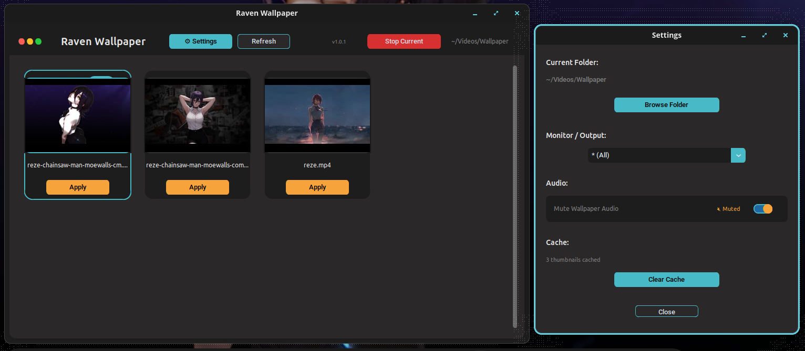

# Raven Wallpaper

A simple, lightweight live video wallpaper selector for Linux (tested on Pop!_OS with COSMIC desktop).

Browse your own video files (.mp4, .webm, .mkv, .mov, .gif), preview thumbnails, and apply them as looped, silent wallpapers using **mpvpaper**.

The app requires mpvpaper to function (it sets the wallpaper). Install with:
```Bash
sudo apt update && sudo apt install mpvpaper
```
## Features

- Custom folder selection
- Thumbnail previews
- Multi-monitor support (with fallback to all monitors)
- Stop/apply controls

  

## Download & Run (Recommended – Standalone Executable)

No installation required! The executable is self-contained (includes bundled ffmpeg for thumbnails).

1. Go to the [**Releases**](https://github.com/Isolated-sloth/Raven-wallpaper/releases/tag/v1.0.0) tab 
   → download the latest version of `Raven Wallpaper` (single file, ~200–400 MB).

2. Make it executable (one-time):
   ```bash
   chmod +x "Raven Wallpaper"

3. Run it:
  ```Bash
  ./"Raven Wallpaper"
  #or double-click in your file manager (may need to right-click → Properties → Permissions → "Allow executing file as program").
  ```
Note: If thumbnails don't show or the app closes immediately:

Install ffmpeg (optional – greatly improves thumbnails):
  ```bash
  sudo apt update && sudo apt install ffmpeg
  Or run from terminal to see errors:Bash./"Raven Wallpaper"
  ```

# Run from Source (For Developers / Customization)
If you want to modify the code or run without the pre-built executable:

Install dependencies (one-time):
```Bash
sudo apt update
sudo apt install python3 python3-pip python3-venv ffmpeg wlr-randr mpvpaper
```
Create & activate virtual environment:
```Bash
python3 -m venv raven_venv
source raven_venv/bin/activate
```
Install Python packages:
```Bash
pip install customtkinter pillow
```
Run the app:
```Bash
python raven_wallpaper.py
```
# Building Your Own Executable (Optional)
If you want to recompile (requires ffmpeg binary in the same folder):
```Bash
# Activate venv first
source raven_venv/bin/activate
```
# Install PyInstaller
pip install pyinstaller

# Build
```Bash
pyinstaller --onefile --windowed --name "Raven Wallpaper" \
  --hidden-import=customtkinter \
  --hidden-import=PIL \
  --hidden-import=PIL.ImageTk \
  --hidden-import=PIL._tkinter_finder \
  --hidden-import=_tkinter \
  --hidden-import=tkinter \
  --collect-all customtkinter \
  --add-binary "ffmpeg:." \
  raven_wallpaper.py
```
The output will be in dist/Raven Wallpaper.
Requirements (for source / debugging only)

Python 3.10+
mpvpaper: 
```
sudo apt install mpvpaper
ffmpeg (for thumbnails): sudo apt install ffmpeg
wlr-randr (for monitor detection – optional): sudo apt install wlr-randr
```
# Troubleshooting

App closes immediately?
> Run from terminal (./"Raven Wallpaper") and share any output/errors.

No thumbnails?
> Install ffmpeg or check if your videos are in a supported format.

[](https://opensource.org/licenses/MIT)
